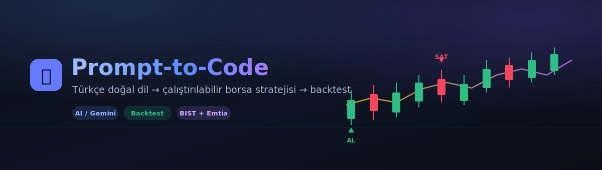
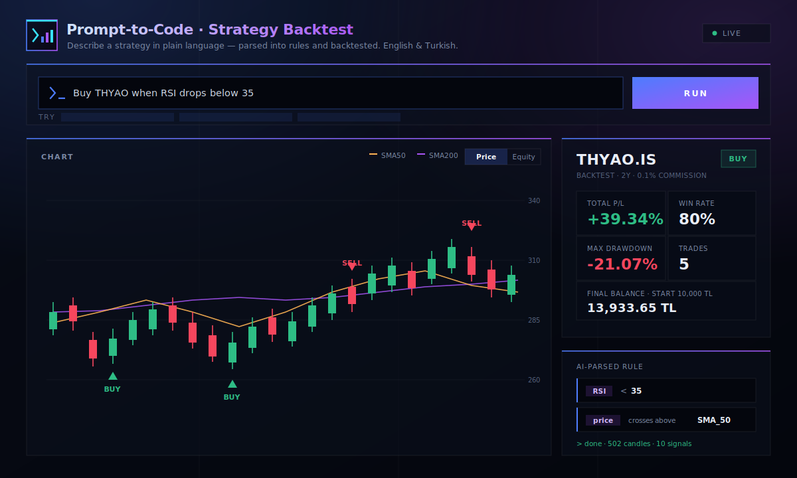

<div align="center">



<br/>

**Turn plain-language trading strategies into executable rules, then backtest them on BIST 100 and commodity data — end to end.**

<br/>


</div>

---

## Overview

Prompt-to-Code lets you write a trading idea the way you would say it — in **English or Turkish** —
and turns it into a structured, testable rule. A natural-language sentence such as
*"Buy THYAO when RSI drops below 35"* is parsed by an AI model into a JSON rule, historical
price data and technical indicators are fetched, a commission-aware backtest is run, and the
results are returned as metrics and chart-ready data.

> **"Buy THYAO when RSI drops below 35"** &nbsp;→&nbsp; AI parses the rule &nbsp;→&nbsp; data is fetched &nbsp;→&nbsp; strategy is backtested &nbsp;→&nbsp; metrics and charts are returned.

<div align="center">
  
</div>

---

## Features

| | |
|---|---|
| **Natural language to rules** | Gemini + Pydantic convert a sentence into a structured JSON rule |
| **Bilingual input** | Understands both English and Turkish phrasing |
| **Local fallback parser** | A regex engine handles common patterns when the API is unavailable |
| **Persistent cache** | Parsed rules are stored on disk, so repeated strategies cost no quota |
| **20+ indicators** | RSI, Stochastic, SMA/EMA (four periods), MACD, ADX, Bollinger Bands, volume |
| **Realistic backtest** | 0.1% commission, 10,000 ₺ starting balance, equity curve |
| **Modern UI** | TradingView candlesticks, BUY/SELL markers, equity-curve tab |
| **Smart symbols** | BIST tickers get `.IS` automatically; commodities map to yfinance symbols |

---

## Tech Stack

<div align="center">

| Layer | Technologies |
|-------|--------------|
| **Backend** |    |
| **Data & Analysis** |    -FF6F00?logoColor=white) |
| **Artificial Intelligence** |   |
| **Frontend** |     |

</div>

---

## Architecture

```mermaid
flowchart LR
    U([User: plain-language strategy]) --> NLP

    subgraph BE["FastAPI Backend"]
        direction TB
        NLP[nlp_parser<br/>Gemini + Pydantic<br/>+ local fallback] --> DATA[data_engine<br/>yfinance + indicators]
        DATA --> BT[backtest_engine<br/>simulation + metrics]
    end

    BT --> API[/api/run-strategy<br/>JSON: chart + metrics]
    API --> FE([Frontend<br/>candles, BUY/SELL, equity])

    CACHE[(rule_cache.json)] -.-> NLP
    NLP -.-> CACHE
```

**Flow:** text → rule (NLP) → data + indicators → commission-aware backtest → JSON → charts.

---

## Project Structure

```
prompt-to-code/
├── data_engine.py        # yfinance data + 20+ technical indicators (cached)
├── nlp_parser.py         # Gemini/regex: text -> TradingRule + persistent cache
├── backtest_engine.py    # vectorized backtest, metric calculation
├── app.py                # FastAPI service + CORS + static frontend
├── frontend/
│   └── index.html        # modern UI (Lightweight Charts)
├── assets/               # README images (SVG)
├── requirements.txt      # pinned dependencies
└── .env.example          # environment variable template
```

---

## Installation

```bash
git clone https://github.com/noutrexx/prompt-to-code.git
cd prompt-to-code
pip install -r requirements.txt
```

Create a `.env` file (see `.env.example`):

```env
GEMINI_API_KEY=your_api_key
```

> Get a free key from [Google AI Studio](https://aistudio.google.com/app/apikey).
> The app also runs **without** a key — in that case the local regex parser is used.

## Usage

```bash
python app.py        # or: uvicorn app:app --reload
```

Open **http://127.0.0.1:8000/** in your browser.

---

## API

### `POST /api/run-strategy`

**Request:**
```json
{ "strateji_metni": "Buy THYAO when RSI drops below 35" }
```

**Response (excerpt):**
```json
{
  "asset": "THYAO.IS",
  "rule": { "conditions": [ { "indicator": "RSI", "operator": "less_than", "value": 35 } ], "action": "BUY" },
  "metrics": { "toplam_kar_zarar_pct": 39.34, "win_rate_pct": 80.0, "max_drawdown_pct": -21.07, "toplam_islem_sayisi": 5 },
  "signals": [ { "date": "2024-08-09", "side": "BUY", "price": 294.77 } ],
  "candles": [ ... ], "sma50": [ ... ], "sma200": [ ... ], "equity": [ ... ]
}
```

### `GET /api/health`
Returns service status and NLP mode (Gemini or local fallback).

---

## Metrics

| Metric | Description |
|--------|-------------|
| **Total P/L (%)** | 10,000 ₺ start, 0.1% commission per trade |
| **Win Rate (%)** | Share of profitable trades |
| **Max Drawdown (%)** | Deepest peak-to-trough decline |
| **Trades** | Number of completed buy/sell round trips |

---

## Roadmap

- [ ] Separate user-defined entry and exit rules
- [ ] Next-bar-open entry (look-ahead correction)
- [ ] Multi-symbol / multi-strategy comparison
- [ ] Unit tests (pytest)

---

## Disclaimer

This project is for **educational and research purposes only**. Past performance does not
guarantee future results, and nothing produced here constitutes **financial advice**.

<div align="center">
<br/>
<sub>Natural-language algorithmic trading · BIST 100 + Commodities</sub>
</div>
