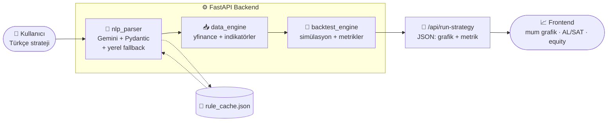

<div align="center">


<br/>

**Türkçe doğal dilde yazdığınız borsa stratejilerini, yapay zeka ile çalıştırılabilir kurallara çevirip BIST 100 ve emtia verisinde geçmişe dönük test (backtest) eden uçtan uca bir sistem.**

<br/>


</div>

---

> **"RSI 35'in altına düştüğünde THYAO al"** &nbsp;→&nbsp; yapay zeka kurala çevirir &nbsp;→&nbsp; veri çekilir &nbsp;→&nbsp; strateji test edilir &nbsp;→&nbsp; metrikler + grafik döner.

<div align="center">
  
</div>

---

## ✨ Özellikler

| | |
|---|---|
| 🧠 **Doğal dil → kural** | Gemini + Pydantic ile Türkçe metni yapılandırılmış JSON kurala çevirir |
| 🛡️ **Yerel fallback** | API erişimi yoksa regex tabanlı çözücü devreye girer (RSI, SMA, MACD, Stochastic…) |
| 💾 **Kalıcı önbellek** | Çözülen kurallar diske kaydedilir; aynı strateji tekrar kota harcamaz |
| 📊 **20+ indikatör** | RSI, Stochastic, SMA/EMA (4 periyot), MACD, ADX, Bollinger, hacim |
| 🔬 **Gerçekçi backtest** | %0.1 komisyon, 10.000 ₺ başlangıç, equity eğrisi |
| 📈 **Modern arayüz** | TradingView mum grafiği, AL/SAT işaretleri, portföy eğrisi sekmesi |
| 🏷️ **Akıllı sembol** | BIST hisseleri otomatik `.IS`, emtialar yfinance sembolüne eşlenir |

---

## 🧱 Teknoloji Yığını

<div align="center">

| Katman | Teknolojiler |
|--------|--------------|
| **Backend** |    |
| **Veri & Analiz** |    -FF6F00?logoColor=white) |
| **Yapay Zeka** |   |
| **Frontend** |     |

</div>

---

## 🏗️ Mimari



**Akış:** Metin → kural (NLP) → veri + indikatör → komisyonlu backtest → JSON → grafik.

---

## 📁 Proje Yapısı

```
prompt-to-code/
├── data_engine.py        # yfinance verisi + 20+ teknik indikatör (önbellekli)
├── nlp_parser.py         # Gemini/regex ile Türkçe → TradingRule + kalıcı cache
├── backtest_engine.py    # vektörel backtest, metrik hesabı
├── app.py                # FastAPI servisi + CORS + statik frontend
├── frontend/
│   └── index.html        # modern arayüz (Lightweight Charts)
├── assets/               # README görselleri (SVG)
├── requirements.txt      # pinlenmiş bağımlılıklar
└── .env.example          # ortam değişkeni şablonu
```

---

## 🚀 Kurulum

```bash
git clone https://github.com/noutrexx/prompt-to-code.git
cd prompt-to-code
pip install -r requirements.txt
```

`.env` dosyası oluşturun (örnek için `.env.example`):

```env
GEMINI_API_KEY=senin_anahtarin
```

> 🔑 Anahtarı [Google AI Studio](https://aistudio.google.com/app/apikey)'dan ücretsiz alabilirsiniz.
> Anahtar olmadan da çalışır — bu durumda **yerel regex çözücü** devreye girer.

## ▶️ Çalıştırma

```bash
python app.py        # veya: uvicorn app:app --reload
```

Tarayıcıda **http://127.0.0.1:8000/** adresini açın.

---

## 📡 API

### `POST /api/run-strategy`

**İstek:**
```json
{ "strateji_metni": "RSI 35'in altına düştüğünde THYAO al." }
```

**Yanıt (özet):**
```json
{
  "asset": "THYAO.IS",
  "rule": { "conditions": [ { "indicator": "RSI", "operator": "less_than", "value": 35 } ], "action": "BUY" },
  "metrics": { "toplam_kar_zarar_pct": 30.84, "win_rate_pct": 75.0, "max_drawdown_pct": -17.5, "toplam_islem_sayisi": 4 },
  "signals": [ { "date": "2025-04-30", "side": "BUY", "price": 277.68 } ],
  "candles": [ ... ], "sma50": [ ... ], "sma200": [ ... ], "equity": [ ... ]
}
```

### `GET /api/health`
Servis ve NLP modu (Gemini / yerel) durumunu döner.

---

## 📊 Metrikler

| Metrik | Açıklama |
|--------|----------|
| **Toplam Kâr/Zarar (%)** | 10.000 ₺ başlangıç, her işlemde %0.1 komisyon |
| **Win Rate (%)** | Kârlı işlemlerin oranı |
| **Max Drawdown (%)** | Zirveden en derin düşüş |
| **Toplam İşlem Sayısı** | Tamamlanan alış-satış çiftleri |

---

## 🗺️ Yol Haritası

- [ ] Kullanıcının ayrı giriş + çıkış kuralı yazabilmesi
- [ ] Bir sonraki bar açılışından giriş (look-ahead düzeltmesi)
- [ ] Çoklu sembol / strateji karşılaştırması
- [ ] Birim testleri (pytest)

---

## ⚠️ Sorumluluk Reddi

Bu proje **eğitim ve araştırma** amaçlıdır. Geçmiş performans gelecekteki sonuçları
garanti etmez ve burada üretilen hiçbir çıktı **yatırım tavsiyesi değildir**.

<div align="center">
<br/>
<sub>Türkçe doğal dil ile algoritmik trade · BIST 100 + Emtia</sub>
</div>
